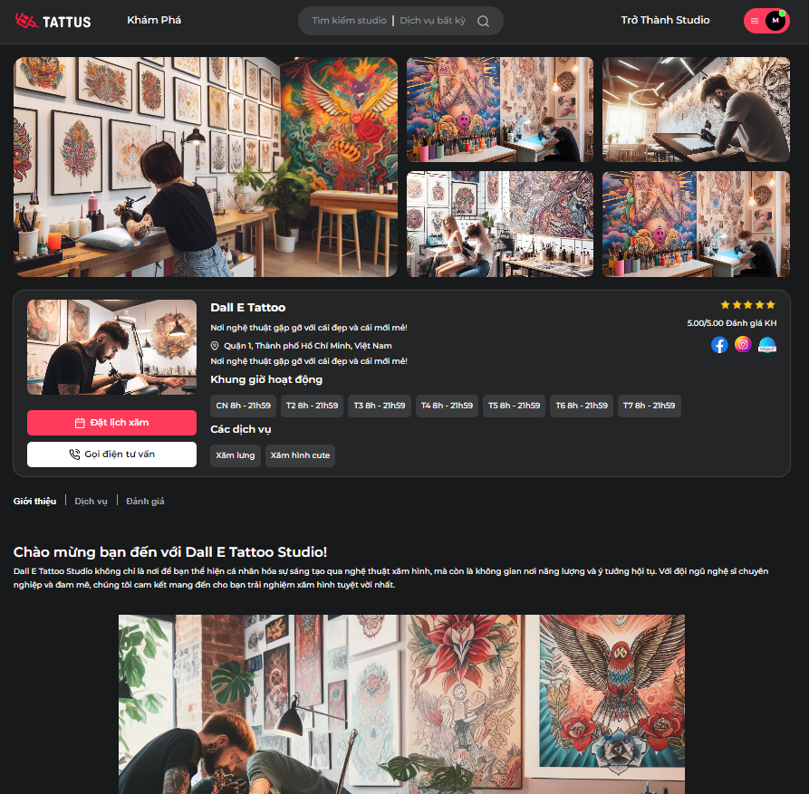

<!-- PROJECT SHIELDS -->
<!--
*** I'm using markdown "reference style" links for readability.
*** Reference links are enclosed in brackets [ ] instead of parentheses ( ).
*** See the bottom of this document for the declaration of the reference variables
*** for contributors-url, forks-url, etc. This is an optional, concise syntax you may use.
*** https://www.markdownguide.org/basic-syntax/#reference-style-links
-->

[![Contributors][contributors-shield]][contributors-url]

<!-- [![Stargazers][stars-shield]][stars-url]
[![Issues][issues-shield]][issues-url]
[![MIT License][license-shield]][license-url]
[![LinkedIn][linkedin-shield]][linkedin-url] -->

<!-- PROJECT LOGO -->
 

  <a href="https://github.com/othneildrew/Best-README-Template">
    <svg xmlns="http://www.w3.org/2000/svg" xmlns:xlink="http://www.w3.org/1999/xlink" width="140.699" height="42.017" viewBox="0 0 586 175">
  <image x="13" y="24" width="181" height="121" xlink:href="data:img/png;base64,iVBORw0KGgoAAAANSUhEUgAAACsAAAAdCAYAAAAzfpVwAAAEMklEQVRYhcWXfWiWZRTGf7OablFOLWhFaW0Z+ZF9kWnLvkhqpFLIUgpXf7Q+tLG/tgyzWVQUFZlaWSEFrRGaFCmIU8uPsKQ0gmrhNqbhRItRC5uorDhy3XC8ed7nfd/p7Prnee7z3M95rufc577OuQsOj6jA4WLgNzKjFrhc139T5g0IBjmnbwK7gTEZPjQEWAzM0w9VDBCnjAhkJwFPAoOBXcDQhBcWu/uLgGP/F9kmZzuSsMQjgRo3fgL45jTwOwFGdipwqTPeDPRE82qj8WSgVPeFwE2ni+xDbvwp8EM0pzSB7INAKzATeAHYBrwPXDKQZE0NOlxk7wA2RXO+B67VfYfydXAGf33aqIuAPzPMqQY6gc35krXIDnPjzuh5lSNqGAdcAbSk+KsD2rVhYwwHPgC+ApYCRfmS7XPjs6Lny93980AvsEd5/k6K3+GKsKVUcQZ/NflqtZE94MZeYy0XS3T/B7AwevfqHPyPcRI3QTkecANwOF+yP7pxta6ms087e13Cux+l5GVAlaTQ8KGzr0zYyDmRfcuNZwC3Aa9F80Y5TR6qPF4GXAC8qNSIsQ74TLYaRRbJ4iP5EkVqYNeNwO1Z5rap1N4LPAo0AK+45wulAgZb+nOV47aBu908W7GXToasaWlXP97/Th8P6nAj8J70ulG2lS5Xe/UT/SrVYWn3q3IdiJ5fBzyW8v71wHoRKlMJHu+Ijog2lanN5ynNUk5kURX6y41NmnZKbkZn6QVmqmNriOzPROMzgUrgJ+Bl4Jx8yPp+tl4OkLNx0dzuqIAkwYrKZdLPC4F9bs5WrZ7H7/qh5Vn8HkeIbIUjinLRwz78CXA0i7+7ndCvcXbL4ylqgD529vO1glZ6Z+VKdnZkr1YK3KWxbb7HlQ5NJGONmhuD5fk1uv/VtZfbgQekKD87L/YjzcCGNFU6Y0Hx8UbpS3X/E4Gz9axU3dVVwLfKZysCq7WktvPPiz54SE3OFvMte7d+osPNbZW+H1KvHPxYCv0CfJ0W2V7lTTmwJJpznxz45nuTcjro5TKnJNYTFLq5oyVta/XjHq/KHrAtSscTEB8YAypFJHa+XRtio7ON18b6Wx1ZSIVMaHTFY6RUJDRQU7RqiQhpEGO3Er9HuRdSw06/c5yUGcGDrv6vUmlGFW+altafRG5VMNpU9bzq2FmwANiRT2Q9inWaeD1qunvVmzaK8ISoOZmslUDHnqeAe7J9TGjXRtvrjYPS3hD+0WYojzqnIilEm449b7tnzY4o2jAW5emaH8Ok7QtnK1N0r/TzcolsjFuA55RfSTCdLUk4dAYUapXmatznlKNOHZkvx3dK0nKKbIzNIlwfnTIC5qcQRfk9T32FRfxZ9+wNYKxy912taotOKf2KrEeZThT3y9alA+WpgvUSVkQeBlacLNkAWyqTNIuMFY1TDxj1H1K66r8BteOiAAAAAElFTkSuQmCC"/>
  <path id="TATTUS" d="M215.517,64.932a7.534,7.534,0,0,0,2.041,5.483,7.223,7.223,0,0,0,5.425,2.1h10.734V126.3a8.011,8.011,0,0,0,2.333,6.008,8.322,8.322,0,0,0,6.067,2.275,8.524,8.524,0,0,0,6.125-2.275,7.9,7.9,0,0,0,2.392-6.008V72.516h10.617a7.023,7.023,0,0,0,7.467-7.467,7.739,7.739,0,0,0-2.042-5.542,7.118,7.118,0,0,0-5.425-2.158H222.983a7.223,7.223,0,0,0-5.425,2.1A7.533,7.533,0,0,0,215.517,64.932Zm74.434,40.834,7.7-27.884,7.817,27.884H289.951Zm37.45,17.267-17.85-57.517a13.115,13.115,0,0,0-4.258-6.359,11.612,11.612,0,0,0-14.117,0,13.11,13.11,0,0,0-4.259,6.359l-18.2,58.45a8.184,8.184,0,0,0-.467,2.567A9.261,9.261,0,0,0,270,132.25q1.75,2.334,5.484,2.333a8,8,0,0,0,5.425-1.866,8.863,8.863,0,0,0,2.858-4.55l2.217-8.284h23.334l2.333,8.167a9.762,9.762,0,0,0,2.917,4.667,7.947,7.947,0,0,0,5.483,1.866,7.064,7.064,0,0,0,5.717-2.508,9.222,9.222,0,0,0,2.1-6.125A11.749,11.749,0,0,0,327.4,123.033Zm0.35-58.1a7.534,7.534,0,0,0,2.041,5.483,7.223,7.223,0,0,0,5.425,2.1h10.734V126.3a8.011,8.011,0,0,0,2.333,6.008,8.322,8.322,0,0,0,6.067,2.275,8.524,8.524,0,0,0,6.125-2.275,7.9,7.9,0,0,0,2.392-6.008V72.516h10.617a7.023,7.023,0,0,0,7.467-7.467,7.739,7.739,0,0,0-2.042-5.542,7.118,7.118,0,0,0-5.425-2.158H335.217a7.223,7.223,0,0,0-5.425,2.1A7.533,7.533,0,0,0,327.751,64.932Zm56.232,0a7.534,7.534,0,0,0,2.042,5.483,7.221,7.221,0,0,0,5.425,2.1h10.734V126.3a8.008,8.008,0,0,0,2.333,6.008,8.322,8.322,0,0,0,6.067,2.275,8.525,8.525,0,0,0,6.125-2.275A7.908,7.908,0,0,0,419.1,126.3V72.516h10.616a7.021,7.021,0,0,0,7.467-7.467,7.738,7.738,0,0,0-2.041-5.542,7.12,7.12,0,0,0-5.426-2.158H391.45a7.221,7.221,0,0,0-5.425,2.1A7.534,7.534,0,0,0,383.983,64.932Zm107.684-8.167A8.324,8.324,0,0,0,485.6,59.04a8.014,8.014,0,0,0-2.333,6.008V108.8q0,5.25-2.684,8.225a10.639,10.639,0,0,1-14.758,0q-2.625-2.976-2.625-8.225V65.049a7.907,7.907,0,0,0-2.392-6.008,8.525,8.525,0,0,0-6.125-2.275,8.324,8.324,0,0,0-6.067,2.275,8.014,8.014,0,0,0-2.333,6.008v44.1a28.982,28.982,0,0,0,1.925,10.791,22.806,22.806,0,0,0,5.483,8.226,24.244,24.244,0,0,0,8.517,5.191,34.5,34.5,0,0,0,22.05,0,24.235,24.235,0,0,0,8.517-5.191,22.808,22.808,0,0,0,5.484-8.226,28.982,28.982,0,0,0,1.925-10.791v-44.1a7.907,7.907,0,0,0-2.392-6.008A8.525,8.525,0,0,0,491.667,56.765ZM555.95,82.2a8.294,8.294,0,0,0,3.966-.933,7.8,7.8,0,0,0,2.8-2.45,8.081,8.081,0,0,0,1.342-3.442,8.559,8.559,0,0,0-.408-4.025,20.648,20.648,0,0,0-8.984-11.142q-6.533-4.025-15.983-4.025a29.688,29.688,0,0,0-10.675,1.808,23.865,23.865,0,0,0-7.992,4.9,20.688,20.688,0,0,0-4.959,7.175,22.034,22.034,0,0,0-1.691,8.517q0,8.4,4.491,13.592t13.242,8.342l12.017,4.317q3.734,1.282,5.075,3.558a9.173,9.173,0,0,1,1.342,4.725,7.179,7.179,0,0,1-2.742,5.775q-2.742,2.275-8.108,2.275a12.263,12.263,0,0,1-7-1.75,9.286,9.286,0,0,1-3.617-4.9q-2.1-6.417-7.934-6.416a7.92,7.92,0,0,0-6.941,3.675,8.349,8.349,0,0,0-1.225,3.5,8.947,8.947,0,0,0,.35,3.791,21.933,21.933,0,0,0,9.625,11.9q6.942,4.2,17.208,4.2a33.486,33.486,0,0,0,11.084-1.75,24.248,24.248,0,0,0,8.517-4.959,22.445,22.445,0,0,0,5.425-7.583,23.644,23.644,0,0,0,1.925-9.625,23.1,23.1,0,0,0-1.634-9.159,19.345,19.345,0,0,0-4.375-6.417,23.806,23.806,0,0,0-6.3-4.317,69.849,69.849,0,0,0-7.292-2.975l-10.033-3.5a11.28,11.28,0,0,1-3.5-1.692,8.821,8.821,0,0,1-1.983-2.042,6.333,6.333,0,0,1-.934-2.042,7.609,7.609,0,0,1-.233-1.692,6.6,6.6,0,0,1,2.333-5.192,9.6,9.6,0,0,1,6.534-2.042q6.417,0,9.45,6.65a9.854,9.854,0,0,0,3.033,3.85A7.644,7.644,0,0,0,555.95,82.2Z"/>
</svg>

  </a>

  <h3 align="center">Art Tattoo Lover</h3>

  

    Dự án platform kết nối những người yêu thích tattoo và các Studio Tattoo trên thị trường
     
    <!-- <a href="https://github.com/othneildrew/Best-README-Template"><strong>Explore the docs »</strong></a>
     
     
    <a href="https://github.com/othneildrew/Best-README-Template">View Demo</a>
    ·
    <a href="https://github.com/othneildrew/Best-README-Template/issues">Report Bug</a>
    ·
    <a href="https://github.com/othneildrew/Best-README-Template/issues">Request Feature</a> -->
  

<!-- TABLE OF CONTENTS -->

  
Mục lục

  <ol>
    <li>
      <a href="#đôi-chút-về-dự-án">Đôi chút về dự án</a>
      <ul>
        <li><a href="#built-with">Các công nghệ xây dựng dự án</a></li>
      </ul>
    </li>
    <li>
      <a href="#getting-started">Getting Started</a>
      <ul>
        <li><a href="#prerequisites">Prerequisites</a></li>
        <li><a href="#installation">Installation</a></li>
      </ul>
    </li>
    <li><a href="#usage">Usage</a></li>
    <li><a href="#roadmap">Roadmap</a></li>
    <li><a href="#contributing">Contributing</a></li>
    <li><a href="#license">License</a></li>
    <li><a href="#contact">Contact</a></li>
    <li><a href="#acknowledgments">Acknowledgments</a></li>
  </ol>

<!-- ABOUT THE PROJECT -->

## ĐÔI CHÚT VỀ DỰ ÁN

[![Product Name Screen Shot][product-screenshot]](https://art-tattoo-lover.vercel.app/)

Dự án này là một phần của môn học SWP391 tại Trường Đại Học FPT HCM

Là một người đam mê với nghệ thuật xăm hình, chắc chắn bạn cần một nơi để kết nối, chia sẻ những khoảnh khắc và niềm đam mê của mình với mọi người hay ít nhất là những người cùng một niềm yêu thích, đam mê với mình. Nhưng hiện nay đang thiếu đi những nền tảng phù hợp, chất lượng để mọi người kết nối với nhau.

Art Tattoo Lover ra đời để giúp bạn thỏa mãn với những điều đó, một trang web giúp kết nối những người có đam mê xăm hình và đặc biệt còn kết nối những Tattoo Studio với những hình xăm ấn tượng, đầy nghệ thuật, tạo ra một môi trường giao lưu, học hỏi hay đi xăm đầy thú vị.

 

  

 

Được xây dựng dưới dạng một platform, Art Tattoo Lover cho phép người dùng tìm kiếm những studio đang có mặt tại Việt Nam hay rộng hơn là trên toàn thế giới. Người dùng có thể tương tác trực tiếp với bản đồ, để tìm những studio gần nhất, có lượt đánh giá cao nhất và không thể nào thiếu sự chất lượng đến từ việc kiểm duyệt chặt chẽ của hệ thống Art Tattoo Lover.

 

[![Map Screen Shot][map-screenshot]](https://art-tattoo-lover.vercel.app/)

 

Người dùng có thể đăng ký, tạo tài khoản xây dựng profile của bản thân với những khoảnh khắc ấn tượng vói hình xăm của bản thân, và đặc biệt còn có thể đặt lịch xăm, tư vấn đến từ các studio với giao diện trực quan dễ dàng đặt lịch, đổi lịch, xem trạng thái lịch hẹn và xem lịch xử xăm tại các studio.

 

[![Profile Screen Shot][profile-screenshot]](https://art-tattoo-lover.vercel.app/)

 

 

[![Bookking Screen Shot][booking-screenshot]](https://art-tattoo-lover.vercel.app/)

 

Điểm qua một số tính năng nổi bật của dự án:

- Tìm kiếm studio với các filter như keyword, vị trí, loại dịch vụ, đánh giá studio,...
- Tương tác với Google Map tìm kiếm studio theo phạm vi bản đồ, tự động hoàn thành địa điểm nhập với Place API.
- Chức năng đặt lịch xăm, đổi lịch xăm, xem lịch sử xăm với các thông tin cần thiết và đầy đủ cho người dùng.
- Trang web riêng cho từng studio cung cấp trình chỉnh sửa văn bản giúp studio dễ dàng thể hiện phong cách.
- Cung cấp hệ thống quản lý riêng cho từng studio giúp quản lý lịch hẹn từ khách hàng, quản lý nhân viên, quản lý khung giờ làm việc của artist, quản lý các dịch vụ, xem báo cáo kinh doanh, quản lý các hóa đơn và quản lý thông tin của studio,...
- Cung cấp trang quản lý hệ thống với quyền admin, và system staff, quản lý người dùng, quản lý các studio

Những tính năng sẽ hoàn thiện trong tương lai gần:

- Blog chia sẻ bài viết về xăm
- Trang giới thiệu và hiển thị chứng chỉ riêng của từng artist
- Hệ thống tự động đánh giá và xếp hạng studio, artist có những hình xăm được đánh giá cao nhất
- Cải thiện UI/UX, hiệu suất của trang web, tracking người dùng, SEO Web,....

Vì dự án chỉ đang ở mức độ học tập và có những hạn chế về mặt nhân lực, tài chính, nên chưa thể nào hoàn thiện hoàn toàn những chức năng cần thiết hay xử lý lỗi một cách hoàn hảo. Nên nhóm rất mong được sự đóng góp nhiệt tình từ thầy cô cũng như những người đã và đang tham khảo dự án này để hoàn thiện hơn vào những dự án sắp tới.

(<a href="#readme-top">back to top</a>)

### CÔNG NGHỆ ĐƯỢC SỬ DỤNG

Dự án Art Tattoo Lover được xây dựng trên thư viện Reactjs và ASP.NET Core API. Một số công nghệ được sử dụng trong dự án như sau

Front-end
 

- [![React][React.js]][React-url]
- [![TanStack][Tanstack-lib]][TanStack-url]
- [![FullCalendar][FullCalendar-lib]][FullCalendar-url]
- [![Lexical][Lexical-badge]][Lexical-url]
- [![MantineUI][MantineUI-badge]][MantineUI-url]
- [![ApexCharts][ApexCharts-badge]][ApexCharts-url]
- [![GoogleMapAPI][GoogleMapAPI-badge]][GoogleMapAPI-url]

 

Back-end
 

- [![.Net][.Net-badge]][.Net-url]
- [![Redis][Redis-badge]][Redis-url]
- [![Mysql][Mysql-badge]][Mysql-url]
- [![Gmail][GmailAPI-badge]][GmailAPI-url]
- [![Firebase][Firebase-badge]][Firebase-url]

DevOps
 

- [![Amazon][Amazon-badge]][Amazon-url]
- [![Docker][Docker-badge]][Docker-url]
- [![Nginx][Nginx-badge]][Nginx-url]

(<a href="#readme-top">back to top</a>)

<!-- MARKDOWN LINKS & IMAGES -->
<!-- https://www.markdownguide.org/basic-syntax/#reference-style-links -->

[contributors-shield]: https://img.shields.io/github/contributors/othneildrew/Best-README-Template.svg?style=for-the-badge
[contributors-url]: https://github.com/manhhaycode/art-tattoo-lover/graphs/contributors
[forks-shield]: https://img.shields.io/github/forks/othneildrew/Best-README-Template.svg?style=for-the-badge
[forks-url]: https://github.com/othneildrew/Best-README-Template/network/members
[stars-shield]: https://img.shields.io/github/stars/othneildrew/Best-README-Template.svg?style=for-the-badge
[stars-url]: https://github.com/othneildrew/Best-README-Template/stargazers
[issues-shield]: https://img.shields.io/github/issues/othneildrew/Best-README-Template.svg?style=for-the-badge
[issues-url]: https://github.com/othneildrew/Best-README-Template/issues
[license-shield]: https://img.shields.io/github/license/othneildrew/Best-README-Template.svg?style=for-the-badge
[license-url]: https://github.com/othneildrew/Best-README-Template/blob/master/LICENSE.txt
[linkedin-shield]: https://img.shields.io/badge/-LinkedIn-black.svg?style=for-the-badge&logo=linkedin&colorB=555
[linkedin-url]: https://linkedin.com/in/othneildrew
[product-screenshot]: screenshot-project-screen.png
[profile-screenshot]: profile-screenshot.png
[map-screenshot]: map-screenshot.png
[booking-screenshot]: booking-screenshot.png
[studio-screenshot]: studio-screenshot.png
[Next.js]: https://img.shields.io/badge/next.js-000000?style=for-the-badge&logo=nextdotjs&logoColor=white
[Next-url]: https://nextjs.org/
[React.js]: https://img.shields.io/badge/React-20232A?style=for-the-badge&logo=react&logoColor=61DAFB
[React-url]: https://reactjs.org/
[TanStack-url]: https://tanstack.com/
[Tanstack-lib]: https://img.shields.io/badge/tanstack-2023?style=for-the-badge&logo=react-query&logoColor=%23fff&color=%23FF4154
[FullCalendar-url]: https://fullcalendar.io/
[FullCalendar-lib]: https://img.shields.io/badge/fullcalendar-2023?style=for-the-badge&logo=google-calendar&logoColor=%234285F4&color=%23000
[.Net-url]: https://dotnet.microsoft.com/en-us/
[.Net-badge]: https://img.shields.io/badge/.Net-2023?style=for-the-badge&logo=.net&logoColor=%23fff&color=%23512BD4
[Lexical-url]: https://lexical.dev/
[Lexical-badge]: https://img.shields.io/badge/lexical-2023?style=for-the-badge&logo=data%3Aimage%2Fpng%3Bbase64%2CiVBORw0KGgoAAAANSUhEUgAAAHYAAACGAgMAAAB1W5abAAAACVBMVEUAAAB2tv%2F%2F%2F%2F8fJNpLAAAAAXRSTlMAQObYZgAAAAFiS0dEAmYLfGQAAAB5SURBVFjDY2AYBaNgqAKuVRDQMCpNgjQQrFq1AF%2B40kd6FRawAiTNtAqkZlQah%2FQCXIE6Ko1fOhQEApggeYM1NGRUmhjpIR7fIMAgCiJDRqWJkR668Q1OwQsYwX5z4IIUmqPShKRHKwuSpUcbJqRLD%2BKG6GjfgAxpAPIkEV8ga3k5AAAAAElFTkSuQmCC&color=%23020528
[Vue.js]: https://img.shields.io/badge/Vue.js-35495E?style=for-the-badge&logo=vuedotjs&logoColor=4FC08D
[ApexCharts-url]: https://apexcharts.com/
[ApexCharts-badge]: https://img.shields.io/badge/apexcharts-2023?style=for-the-badge&logo=chart.js&logoColor=%23fff&color=%23FF6384
[MantineUI-url]: https://mantine.dev/
[MantineUI-badge]: https://img.shields.io/badge/mantine-2023?style=for-the-badge&logo=mantine&logoColor=%23fff&color=%23339AF0
[GoogleMapAPI-url]: https://developers.google.com/maps
[GoogleMapAPI-badge]: https://img.shields.io/badge/google%20Map%20API-2023?style=for-the-badge&logo=googlemaps&logoColor=%23fff&color=%234285F4
[Redis-url]: https://redis.io/
[Redis-badge]: https://img.shields.io/badge/redis-2023?style=for-the-badge&logo=redis&logoColor=%23fff&color=%23DC382D
[Mysql-url]: https://www.mysql.com/
[Mysql-badge]: https://img.shields.io/badge/mysql-2023?style=for-the-badge&logo=mysql&logoColor=%23fff&color=%234479A1
[Docker-url]: https://www.docker.com/
[Docker-badge]: https://img.shields.io/badge/docker-2023?style=for-the-badge&logo=docker&logoColor=%23fff&color=%232496ED
[Nginx-url]: https://www.nginx.com/
[Nginx-badge]: https://img.shields.io/badge/nginx-2023?style=for-the-badge&logo=nginx&logoColor=%23fff&color=%23009639
[Amazon-url]: https://aws.amazon.com/vi/free/compute/lightsail/?gclid=CjwKCAiAx_GqBhBQEiwAlDNAZlzdJ79C7YzukLmNZzhd8xieNtqD1N9caoAh8XPF22CiTbrcGOuxwRoC6EAQAvD_BwE&trk=13b576c7-da6f-4140-99fb-c995644b5b46&sc_channel=ps&ef_id=CjwKCAiAx_GqBhBQEiwAlDNAZlzdJ79C7YzukLmNZzhd8xieNtqD1N9caoAh8XPF22CiTbrcGOuxwRoC6EAQAvD_BwE:G:s&s_kwcid=AL!4422!3!536393186542!e!!g!!amazon%20lightsail!11543056261!112002969349
[Amazon-badge]: https://img.shields.io/badge/amazon%20lightsail-2023?style=for-the-badge&logo=amazon%20ec2&logoColor=%23fff&color=%23FF9900
[GmailAPI-url]: https://developers.google.com/gmail/api/guides
[GmailAPI-badge]: https://img.shields.io/badge/Gmail%20API-2023?style=for-the-badge&logo=gmail&logoColor=%23fff&color=%23EA4335
[Firebase-url]: https://firebase.google.com/?gad_source=1&gclid=CjwKCAiAx_GqBhBQEiwAlDNAZjQHTy4MscJLrbz0O9AGJ0MX1CUrfiuiGg9s7ec4RjpfoytP-liVFhoCIscQAvD_BwE&gclsrc=aw.ds
[Firebase-badge]: https://img.shields.io/badge/Firebase-2023?style=for-the-badge&logo=firebase&logoColor=%23fff&color=%23FFCA28
[Vue-url]: https://vuejs.org/
[Angular.io]: https://img.shields.io/badge/Angular-DD0031?style=for-the-badge&logo=angular&logoColor=white
[Angular-url]: https://angular.io/
[Svelte.dev]: https://img.shields.io/badge/Svelte-4A4A55?style=for-the-badge&logo=svelte&logoColor=FF3E00
[Svelte-url]: https://svelte.dev/
[Laravel.com]: https://img.shields.io/badge/Laravel-FF2D20?style=for-the-badge&logo=laravel&logoColor=white
[Laravel-url]: https://laravel.com
[Bootstrap.com]: https://img.shields.io/badge/Bootstrap-563D7C?style=for-the-badge&logo=bootstrap&logoColor=white
[Bootstrap-url]: https://getbootstrap.com
[JQuery.com]: https://img.shields.io/badge/jQuery-0769AD?style=for-the-badge&logo=jquery&logoColor=white
[JQuery-url]: https://jquery.com
